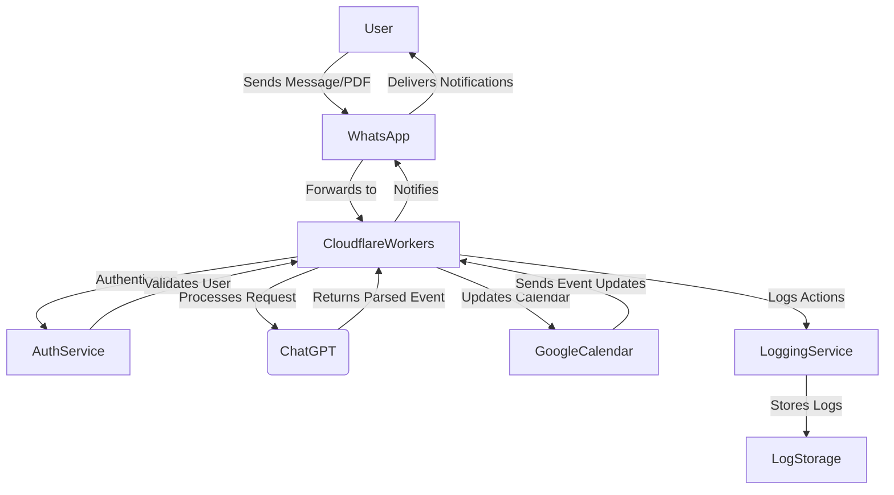

# whatsapp-pdf-bot
# WhatsApp PDF to Google Calendar Bot

## Purpose
This project aims to create a seamless integration between WhatsApp messages (containing PDFs or text) and Google Calendar by automatically processing event details and syncing them into a shared calendar. The bot enables users to streamline event organisation, improve collaboration, and reduce manual data entry efforts.

## Motivation
The bot was designed to solve the common problem of consolidating event details from various communication channels. It is particularly useful for:

- Parents organising school activities.
- Professionals managing team schedules.
- Individuals handling multiple events across different groups.

By automating this process, the bot saves time, minimises errors, and enhances productivity. And helps to relieve the stress of overworked parents. 

## System Overview
The bot:
1. Listens to incoming WhatsApp messages via a webhook.
2. Processes messages to extract event details (PDF or text).
3. Updates Google Calendar with events, including reminders and metadata.

### Architecture Diagram (Mermaid)


## Project Structure
```
whatsapp-pdf-calendar-bot/
|-- .env                    # Environment configurations
|-- package.json            # Dependencies and scripts
|-- src/
    |-- index.js            # Main entry point
    |-- router.js           # Routes for message handling
    |-- services/
        |-- whatsappHandler.js      # WhatsApp message processing
        |-- pdfProcessingService.js # PDF processing
        |-- calendarService.js      # Google Calendar interactions
        |-- openaiHandler.js      # Extract event details from the pdf using ChatGPT
    |-- utils/
        |-- logger.js       # Logging utilities
```

## Costing Table
| Component               | Cost Estimate (Monthly)            |
|-------------------------|-------------------------------------|
| Cloudflare Workers      | Free tier covers most usage         |
| WhatsApp API            | Dependent on usage; estimated ~$10  |
| Google Cloud Services   | Free tier likely sufficient         |
| OpenAI API              | Dependent on usage; estimated ~$20  |

Total Estimated Cost: ~$30/month (under moderate usage)

## Configuration
### .env File
```
NODE_ENV=development
PORT=8080
WHATSAPP_API_URL=https://api.whatsapp.com/send
WHATSAPP_API_KEY=<your-whatsapp-api-key>
WHATSAPP_WEBHOOK_SECRET=<your-webhook-secret>
OPENAI_API_KEY=<your-openai-api-key>
OPENAI_MODEL=text-davinci-003
OPENAI_MAX_TOKENS=500
GOOGLE_CALENDAR_ID=<your-calendar-id>
GOOGLE_CREDENTIALS='{"type": "service_account", "project_id": "project-id", ...}'
TEMP_FILE_STORAGE=/tmp/pdf-storage
TEMP_FILE_CLEANUP_INTERVAL=3600
LOG_LEVEL=info
LOG_FILE=/var/log/project-log.log
AUTH_TOKEN_SECRET=<your-auth-secret>
RATE_LIMIT_WINDOW=15
RATE_LIMIT_MAX=100
REMINDER_OFFSET_DAYS=1
```

## Setup and Usage
### Prerequisites
1. Node.js (latest stable version).
2. Wrangler CLI for Cloudflare Workers.

### Installation
1. Clone the repository.
2. Install dependencies: `npm install`
3. Configure `.env` with your credentials.

### Run Locally
```bash
npm run start
```

### Deployment
```bash
npm run build
```

## Features
- **WhatsApp Integration**: Listens to incoming messages and processes them.
- **PDF Parsing**: Extracts event details, including class names, descriptions, and dates.
- **Google Calendar Sync**: Adds events with reminders and metadata.
- **Error Handling**: Logs errors and handles unsupported message types gracefully.
- **AI parsing**: Extraction of event details from a pdf

## Future Enhancements
- Add support for additional message types.
- Implement analytics for processed messages and calendar events.
- Enhance PDF parsing with AI-based extraction for complex documents.
- Able to talk to the bot to retrieve details from the calendar. ie. What is a week at a glance look like, or month at a glance.  Perhaps additional detail if the events cost money or require parents permissions. 

